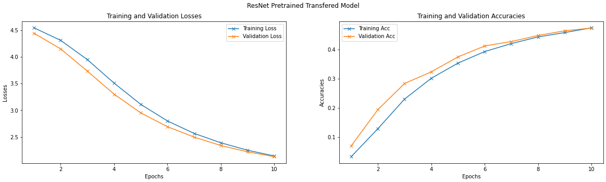
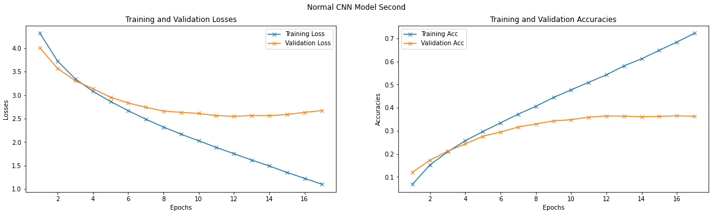

# Transfer Learning with PyTorch

## Using ResNet18 Pretrained Model to Classify CIFAR100 Images


### **About Data**
`CIFAR100` dataset is used here. This dataset contains 60,000 images of 100 different classes of objects with corresponding labels, where 50,000 images are for training and 10,000 are for testing. Here, 50,000 training images are splied into 45,000 actual training images and 5,000 validation images.

<hr>

### **Data Pre-processing**
Images have been resized to `(224 x 224)` for Transfer Learning Network. Images have been normalized using `torchvision.transforms.Normalize` with different mean and std for Normal CNN Network input and Transfer Learning Network input.
```py
# For Normal CNN Network
mean = [0.5071, 0.4867, 0.4408], std = [0.2675, 0.2565, 0.2761]

# For Transfer Learning Network
mean = [0.485, 0.456, 0.406], std = [0.229, 0.224, 0.225]
```
<hr>

### **CNN Network**
Input shape of manually built CNN network is `[batch_size, 3, 32, 32]` and output shape is `[batch_size, 100]`.

Model summary,

```
----------------------------------------------------------------
        Layer (type)               Output Shape         Param #
================================================================
            Conv2d-1          [200, 16, 32, 32]             448
              ReLU-2          [200, 16, 32, 32]               0
       BatchNorm2d-3          [200, 16, 32, 32]              32
         MaxPool2d-4          [200, 16, 16, 16]               0
            Conv2d-5          [200, 32, 16, 16]           4,640
              ReLU-6          [200, 32, 16, 16]               0
       BatchNorm2d-7          [200, 32, 16, 16]              64
         MaxPool2d-8            [200, 32, 8, 8]               0
            Conv2d-9            [200, 64, 8, 8]          18,496
             ReLU-10            [200, 64, 8, 8]               0
      BatchNorm2d-11            [200, 64, 8, 8]             128
        MaxPool2d-12            [200, 64, 4, 4]               0
           Conv2d-13           [200, 128, 4, 4]          73,856
             ReLU-14           [200, 128, 4, 4]               0
      BatchNorm2d-15           [200, 128, 4, 4]             256
        MaxPool2d-16           [200, 128, 2, 2]               0
           Conv2d-17           [200, 512, 2, 2]         590,336
             ReLU-18           [200, 512, 2, 2]               0
      BatchNorm2d-19           [200, 512, 2, 2]           1,024
        MaxPool2d-20           [200, 512, 1, 1]               0
          Flatten-21                 [200, 512]               0
           Linear-22                 [200, 256]         131,328
             ReLU-23                 [200, 256]               0
           Linear-24                 [200, 100]          25,700
================================================================
Total params: 846,308
Trainable params: 846,308
Non-trainable params: 0
----------------------------------------------------------------
Input size (MB): 2.34
Forward/backward pass size (MB): 164.22
Params size (MB): 3.23
Estimated Total Size (MB): 169.79
----------------------------------------------------------------
```

This model took **89.83s seconds** to train for **10 epochs**. After training it has achived,


**----**|**Loss**|**Accuracy**
:-----:|:-----:|:-----:
**Train**| 2.0009| 0.4813
**Validation**| 2.5038| 0.3629
**Test**| 2.5027| 0.3611

<br>

Here is it's Loss-Accuracy Plots,


<hr>

### **Transfer Learning Network**
Last dense layer of ResNet18 pretrained model in replaced with `nn.Identity` layer. So, the output dimmension became `[batch_size, 512]`.

A sequential layer of two dense layers have been attached after that. It's structure is,

```py
# sequential layer
nn.Sequential(
    nn.Linear(in_features=512, out_features=256),
    nn.ReLU(inplace=True),
    nn.Linear(in_features=256, out_features=100),
)
```
So overall output dimmension becomes `[batch_size, 100]`.

Here is how our batch of input data passes through this model,


Model summary,

(Only number of parameters and trainable parameters are written here. Look at [the notobook](torch_transfer_learning.ipynb) for more info.)

```
Total params: 11,333,540
Trainable params: 157,028
Non-trainable params: 11,176,512
---------------------------------------------
Input size (MB): 114.84
Forward/backward pass size (MB): 12559.53
Params size (MB): 43.23
Estimated Total Size (MB): 12717.61
---------------------------------------------
```
This model took **745.74s seconds** to train for **10 epochs**. After training it has achived,
    
**----**|**Loss**|**Accuracy**
:-----:|:-----:|:-----:
**Train**| 2.1418| 0.4744
**Validation**| 2.1291| 0.4737
**Test**| 2.1266| 0.4734

<br>

Here is it's Loss-Accuracy Plots,



<hr>

### **Observations**

* Validation and tesing accuracies of Transfer Learning Network is more than Normal CNN Network.
* Transfer Learning Network took more time to train than Normal CNN Network for same number of epochs.
* After letting a Normal CNN Network train to achieve maximum Transfer Learning Network validation accuracy (which is `0.4737` in this case), it has stopped after `17` epochs, as there was no validation accuracy improvement for `5` consecutive epochs. It has achieved best validation accuracy of `0.3629` which is still less than Transfer Learning Network's best validation accuracy. Here is it's Loss-Accuracy table and plots,

    **----**|**Loss**|**Accuracy**
    :-----:|:-----:|:-----:
    **Train**| 1.001| 0.7227
    **Validation**| 2.6721| 0.3629
    **Test**| 2.6038| 0.3712


    